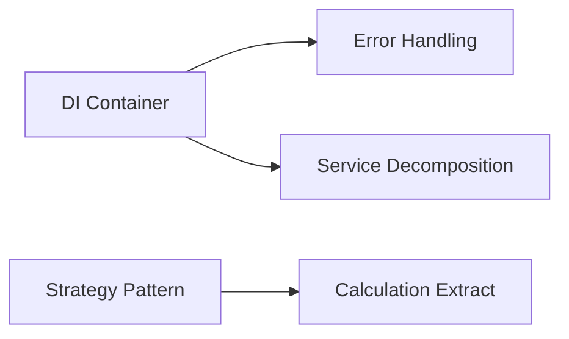

# Code Quality Refactoring Tasks

## Executive Summary

This document outlines **10 critical refactoring tasks** identified from the Phase 1 quality analysis. These tasks target the most significant maintainability issues in the Discord LLM Bot codebase, focusing on **complexity reduction**, **duplication elimination**, and **architectural improvements**.

### Key Findings
- **Critical Complexity**: `shouldRoast()` method has 22 cyclomatic complexity (146 lines)
- **Monolithic Files**: Interface file with 1,313 lines violates Single Responsibility 
- **Code Duplication**: 200-250 lines of duplicated permission checking and error handling
- **Maintainability Score**: 83.5/100 with clear improvement opportunities

---

## 🔥 Critical Priority Tasks (Phase 1)

### REF-001: Extract shouldRoast() Decision Tree Using Strategy Pattern
**Priority**: Critical | **Effort**: 8 hours | **Complexity Reduction**

**Problem**: The `shouldRoast()` method in `roastingEngine.ts` has excessive complexity (22) and 146 lines, making it difficult to maintain and test.

**Solution**: Extract decision logic into dedicated strategy classes:
- `BaseChanceStrategy` - Base probability calculations
- `ConsecutiveBonusStrategy` - Streak-based modifiers
- `ComplexityModifierStrategy` - Message complexity analysis
- `TimeBasedStrategy` - Time-of-day factors
- `MoodStrategy` - Bot mood calculations
- `ChaosStrategy` - Chaos mode handling

**Success Criteria**:
- ✅ Method reduced to <30 lines
- ✅ Complexity reduced from 22 to <8
- ✅ 15-20% performance improvement
- ✅ >90% test coverage on strategies

### REF-002: Split Large Interface File by Domain
**Priority**: High | **Effort**: 6 hours | **Structural Improvement**

**Problem**: `src/services/interfaces/index.ts` contains 1,313 lines, violating Interface Segregation Principle.

**Solution**: Split into domain-specific files:
- `IAIServiceInterfaces.ts` - AI/Gemini interfaces
- `IAnalyticsInterfaces.ts` - Analytics and reporting
- `IConfigurationInterfaces.ts` - Configuration management
- `IContextInterfaces.ts` - Context and memory
- `IMonitoringInterfaces.ts` - Health monitoring

**Success Criteria**:
- ✅ No file exceeds 300 lines
- ✅ Clear domain separation
- ✅ All imports updated successfully

### REF-003: Create Shared Permission Checking Utility
**Priority**: High | **Effort**: 4 hours | **Duplication Elimination**

**Problem**: 200-250 lines of duplicated permission checking logic across commands.

**Solution**: Centralized permission management:
- `IPermissionManager` interface
- `PermissionManager` with role-based checking
- `PermissionCache` for performance
- Replace duplicate logic in all command files

**Success Criteria**:
- ✅ >80% reduction in duplicate code
- ✅ >30% permission checking performance improvement
- ✅ Consistent permission error messages

### REF-009: Enhance Type Safety
**Priority**: High | **Effort**: 8 hours | **Type Safety**

**Problem**: Unsafe `any` types and casting throughout the codebase reduces type safety.

**Solution**: Comprehensive type safety improvements:
- Audit and replace all `any` types
- Create strict type definitions
- Add runtime type guards
- Enable strict TypeScript options

**Success Criteria**:
- ✅ Zero `any` types in application code
- ✅ All strict TypeScript checks pass
- ✅ Runtime type checking implemented

---

## 🔧 Medium Priority Tasks (Phase 2)

### REF-004: Standardize Discord Interaction Error Handling
**Effort**: 5 hours | **Category**: Duplication Elimination

Consolidate Discord API error handling patterns into reusable modules with retry logic and user-friendly messages.

### REF-005: Decompose Large Service Files 
**Effort**: 10 hours | **Category**: Structural Improvement

Break down:
- `analyticsManager.ts` (1,105 lines) → Data, Reporting, Privacy services
- `configurationManager.ts` (965 lines) → Validator, Persistence, Versioning services

### REF-006: Implement Proper Dependency Injection
**Effort**: 6 hours | **Category**: Architecture Optimization

Replace direct service instantiation with DI container for better testability and modularity.

### REF-007: Extract Roasting Calculation Methods
**Effort**: 4 hours | **Category**: Complexity Reduction

Move complex calculation logic into specialized calculator classes with caching.

---

## 🔍 Final Optimization Tasks (Phase 3)

### REF-008: Create Configuration Validation Utility
**Effort**: 3 hours | **Category**: Duplication Elimination

Centralize configuration validation logic across all services.

### REF-010: Extract Command Registration Patterns  
**Effort**: 4 hours | **Category**: Structural Improvement

Create reusable command factory pattern to reduce `commands/index.ts` from 911 lines.

---

## 📊 Success Metrics

| Metric | Current | Target | Impact |
|--------|---------|--------|---------|
| Maintainability Score | 83.5/100 | >90/100 | +7.7% improvement |
| Max Method Complexity | 22 | <8 | 64% reduction |
| Duplicated Code Lines | 200-250 | <50 | 80% reduction |
| Largest File Size | 1,313 lines | <500 lines | 62% reduction |
| Test Coverage | 85% | >90% | +5% improvement |

## 🎯 Execution Strategy

### Phase 1: Critical Issues (26 hours)
Focus on `shouldRoast()` complexity, interface segregation, permission duplication, and type safety.

### Phase 2: Architecture (25 hours) 
Structural improvements including service decomposition, dependency injection, and error handling.

### Phase 3: Final Polish (7 hours)
Configuration validation and command pattern optimization.

## 🛡️ Risk Mitigation

- **Git Checkpoints**: Create commits before each refactoring task
- **Rollback Procedures**: Documented for each task with risk levels
- **Testing Strategy**: Comprehensive unit and integration tests
- **Performance Validation**: Benchmarks to ensure no degradation

## 📋 Task Dependencies

---

## Next Steps

1. **Review and approve** refactoring task priorities
2. **Execute Phase 1** critical tasks first
3. **Validate success criteria** after each task
4. **Monitor performance** impacts during implementation
5. **Update documentation** as architecture evolves

Each task includes detailed implementation steps, acceptance criteria, rollback procedures, and validation requirements to ensure successful execution with minimal risk.