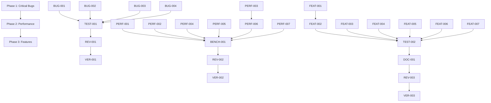

# EXECUTION TIMELINE - Discord LLM Bot Enhancement

## Overview
This document provides a comprehensive timeline for executing all phases of the Discord LLM Bot enhancement project using the Claude Agent Execution Framework (CAEF).

## Timeline Summary
- **Total Duration**: 2-3 weeks
- **Phase 1**: 1-2 days (Critical Bug Fixes)
- **Phase 2**: 3-5 days (Performance Optimization)
- **Phase 3**: 1-2 weeks (Feature Enhancement)

## Dependency Graph


## Phase 1: Critical Bug Fixes (Days 1-2)

### Day 1 Morning (4 hours)
```yaml
parallel_execution:
  - agent: developer_agent_1
    task: BUG-001 (Discord Intent)
    duration: 30 minutes
    
  - agent: developer_agent_2
    task: BUG-002 (Type Safety)
    duration: 1 hour
    
  - agent: developer_agent_3
    task: BUG-003 (Memory Leak)
    duration: 1 hour
    
  - agent: developer_agent_4
    task: BUG-004 (Error Handling)
    duration: 1.5 hours
```

### Day 1 Afternoon (4 hours)
```yaml
sequential_execution:
  - agent: tester_agent
    task: TEST-001 (Bug Fix Tests)
    duration: 2 hours
    dependencies: [BUG-001, BUG-002, BUG-003, BUG-004]
    
  - agent: reviewer_agent
    task: REV-001 (Code Review)
    duration: 1 hour
    dependencies: [TEST-001]
    
  - agent: verifier_agent
    task: VER-001 (Final Verification)
    duration: 1 hour
    dependencies: [REV-001]
```

### Day 2 (Buffer/Fixes)
- Reserved for any fixes identified during review
- Rerun failed tests
- Documentation updates

## Phase 2: Performance Optimization (Days 3-7)

### Day 3 (Baseline & Initial Optimizations)
```yaml
morning:
  - agent: performance_agent
    task: Establish performance baselines
    duration: 2 hours
    
parallel_afternoon:
  - agent: performance_agent_1
    task: PERF-001 (Context Manager)
    duration: 2 hours
    
  - agent: performance_agent_2
    task: PERF-002 (Message Splitting)
    duration: 1.5 hours
```

### Day 4 (Core Optimizations)
```yaml
parallel_execution:
  - agent: developer_agent_1
    task: PERF-003 (Conversation Memory)
    duration: 3 hours
    
  - agent: developer_agent_2
    task: PERF-004 (Rate Limiter I/O)
    duration: 2 hours
    
  - agent: performance_agent
    task: PERF-005 (Roast Probability)
    duration: 1.5 hours
```

### Day 5 (Advanced Optimizations)
```yaml
sequential_execution:
  - agent: developer_agent
    task: PERF-006 (Response Cache)
    duration: 4 hours
    dependencies: [PERF-003]
    
parallel_execution:
  - agent: developer_agent_2
    task: PERF-007 (Parallel Processing)
    duration: 4 hours
```

### Day 6 (Testing & Review)
```yaml
sequential_execution:
  - agent: tester_agent
    task: BENCH-001 (Performance Benchmarks)
    duration: 3 hours
    dependencies: [All PERF tasks]
    
  - agent: reviewer_agent
    task: REV-002 (Performance Review)
    duration: 2 hours
    dependencies: [BENCH-001]
```

### Day 7 (Verification & Tuning)
```yaml
execution:
  - agent: verifier_agent
    task: VER-002 (Performance Verification)
    duration: 2 hours
    dependencies: [REV-002]
    
  - agent: developer_agent
    task: Performance tuning based on results
    duration: 2 hours
```

## Phase 3: Feature Enhancement (Days 8-14+)

### Week 2, Days 8-9 (Foundation Features)
```yaml
day_8:
  - agent: developer_agent_1
    task: FEAT-001 (Health Monitoring)
    duration: 6 hours
    
day_9:
  - agent: developer_agent_1
    task: FEAT-002 (Graceful Degradation)
    duration: 5 hours
    dependencies: [FEAT-001]
```

### Week 2, Days 10-11 (Core Features)
```yaml
parallel_execution:
  - agent: developer_agent_1
    task: FEAT-003 (Context Summarization)
    duration: 8 hours
    
  - agent: developer_agent_2
    task: FEAT-004 (Configuration Management)
    duration: 4 hours
    
  - agent: developer_agent_3
    task: FEAT-006 (UX Enhancements)
    duration: 5 hours
```

### Week 2, Day 12 (Additional Features)
```yaml
execution:
  - agent: developer_agent
    task: FEAT-007 (Analytics)
    duration: 6 hours
    
  - agent: developer_agent_2
    task: FEAT-005 (Prepare Advanced AI)
    duration: 2 hours
    note: Implementation pending API update
```

### Week 3, Days 13-14 (Testing & Documentation)
```yaml
day_13:
  - agent: tester_agent
    task: TEST-002 (Feature Tests)
    duration: 8 hours
    dependencies: [All FEAT tasks]
    
day_14_morning:
  - agent: developer_agent
    task: DOC-001 (Documentation)
    duration: 4 hours
    dependencies: [TEST-002]
    
day_14_afternoon:
  - agent: reviewer_agent
    task: REV-003 (Feature Review)
    duration: 3 hours
    dependencies: [DOC-001]
    
  - agent: verifier_agent
    task: VER-003 (Final Verification)
    duration: 3 hours
    dependencies: [REV-003]
```

## Critical Path Analysis

### Blocking Dependencies
1. **Phase 1 → Phase 2**: Must fix critical bugs before optimizing
2. **FEAT-001 → FEAT-002**: Monitoring required for degradation
3. **PERF-003 → PERF-006**: Memory management affects caching
4. **All Dev → Testing**: Can't test until implementation complete

### Parallel Opportunities
1. **Phase 1**: All bug fixes can run in parallel
2. **Phase 2**: PERF-001, 002, 004, 005 are independent
3. **Phase 3**: FEAT-003, 004, 006 can run simultaneously

## Resource Allocation

### Agent Pool Requirements
```yaml
peak_concurrent_agents: 4
agent_types_needed:
  - master_agent: 1 (continuous)
  - developer_agent: 3 (peak)
  - performance_agent: 2 (Phase 2)
  - tester_agent: 1
  - reviewer_agent: 1
  - verifier_agent: 1
  - security_agent: 1 (as needed)
```

### Human Oversight Points
1. End of each phase
2. After failed verifications
3. Architecture decisions
4. Production deployment approval

## Risk Mitigation Timeline

### Checkpoint Schedule
- **Day 2**: Phase 1 completion checkpoint
- **Day 5**: Performance baseline comparison
- **Day 7**: Phase 2 go/no-go decision
- **Day 11**: Feature complexity review
- **Day 14**: Final deployment readiness

### Buffer Time Allocation
- Phase 1: 0.5 days buffer (included)
- Phase 2: 1 day buffer (Day 7)
- Phase 3: 2 days buffer (flexible end date)

## Success Metrics Timeline

### Phase 1 Metrics (Day 2)
- ✓ All TypeScript errors resolved
- ✓ Reaction tracking functional
- ✓ No memory leaks detected
- ✓ 100% bug fix test coverage

### Phase 2 Metrics (Day 7)
- ✓ 30%+ performance improvement
- ✓ Response time <100ms
- ✓ Memory usage <512MB
- ✓ All benchmarks passing

### Phase 3 Metrics (Day 14+)
- ✓ Health monitoring operational
- ✓ Graceful degradation tested
- ✓ 85%+ feature test coverage
- ✓ Documentation complete

## Execution Commands

### Phase 1 Kickoff
```bash
Task: "Master Agent: Execute Phase 1 timeline - Deploy parallel agents for BUG-001 through BUG-004"
```

### Phase 2 Kickoff
```bash
Task: "Master Agent: Execute Phase 2 timeline - Establish baselines then deploy performance optimization agents"
```

### Phase 3 Kickoff
```bash
Task: "Master Agent: Execute Phase 3 timeline - Sequential feature development starting with health monitoring"
```

## Continuous Improvement

After each phase completion:
1. Analyze agent performance metrics
2. Identify process improvements
3. Update CAEF documentation
4. Refine time estimates
5. Document lessons learned

## Final Deliverable Timeline

### Week 1 Deliverables
- Fixed critical bugs
- Improved performance metrics
- Updated documentation

### Week 2 Deliverables
- Health monitoring system
- Graceful degradation
- Core feature implementations

### Week 3 Deliverables
- Complete feature set
- Comprehensive documentation
- Deployment-ready codebase
- Project completion report