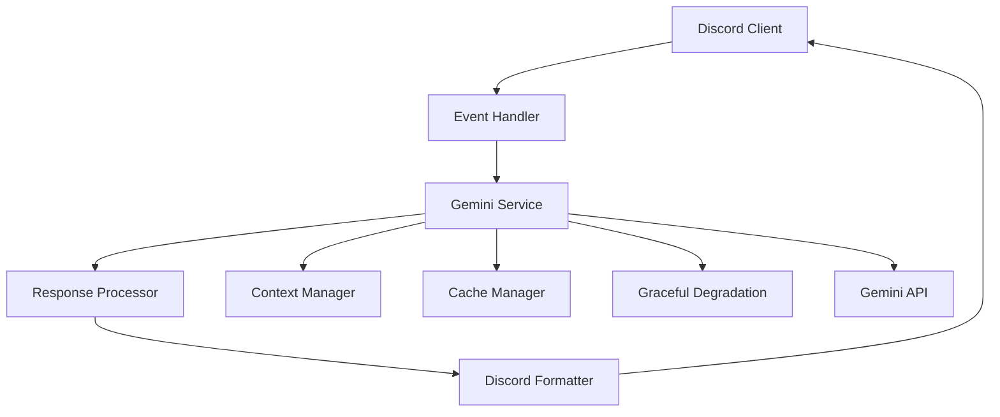

# GeminiService API Documentation

## Table of Contents

1. [Overview](#overview)
2. [Quick Start](#quick-start)
3. [Core API Reference](#core-api-reference)
4. [Configuration](#configuration)
5. [Integration Patterns](#integration-patterns)
6. [Advanced Features](#advanced-features)
7. [Error Handling](#error-handling)
8. [Performance Optimization](#performance-optimization)
9. [Testing](#testing)
10. [Troubleshooting](#troubleshooting)

## Overview

The GeminiService is the primary AI interface for the Discord LLM Bot, providing comprehensive text generation, multimodal processing, and sophisticated response handling capabilities. It serves as the central hub for all AI-related operations within the bot ecosystem.

### Key Features

- **🤖 AI Text Generation**: Advanced text generation with context-aware responses
- **🖼️ Multimodal Processing**: Support for text + image inputs with vision capabilities
- **⚡ Streaming Responses**: Real-time response delivery for improved UX
- **🔄 Graceful Degradation**: Circuit breaker patterns and fallback mechanisms
- **📊 Context Management**: Multi-source context aggregation and optimization
- **🚀 Performance Optimization**: Caching, rate limiting, and resource management
- **🛡️ Security & Privacy**: Data protection and user privacy controls

### Architecture



## Quick Start

### Basic Setup

```typescript
import { GeminiService } from './services/gemini';
import { serviceFactory } from './services/interfaces/serviceFactory';

// Create service with dependencies
const geminiService = await serviceFactory.createAIServiceWithDependencies(
  process.env.GEMINI_API_KEY!,
  geminiConfig,
  dependencies
);

// Initialize service
await geminiService.initialize();

// Set required dependencies
geminiService.setDiscordClient(discordClient);
geminiService.setHealthMonitor(healthMonitor);
```

### Simple Text Generation

```typescript
// Basic text generation
const response = await geminiService.generateResponse(
  "Explain async/await in JavaScript",
  userId,
  serverId
);

console.log(response); // AI-generated explanation
```

### With Discord Context

```typescript
// Text generation with full Discord context
const response = await geminiService.generateResponse(
  prompt,
  message.author.id,
  message.guild?.id,
  undefined, // No streaming
  messageContext,
  message.member,
  message.guild
);
```

## Core API Reference

### Primary Interface

```typescript
interface IAIService extends 
  IAITextGenerator,
  IAIQuotaManager,
  IAIConversationManager,
  IAIContextManager,
  IAIDependencyManager,
  IAICacheManager,
  IAIDegradationManager,
  IAIConfigurationManager {
}
```

### Core Methods

#### `generateResponse`

Primary method for AI text generation with comprehensive context support.

```typescript
generateResponse(
  prompt: string,
  userId: string,
  serverId?: string,
  respond?: (response: string) => Promise<void>,
  messageContext?: MessageContext,
  member?: GuildMember,
  guild?: Guild,
  imageAttachments?: ImageAttachment[]
): Promise<string>
```

**Parameters:**
- `prompt` - The input text/question for the AI
- `userId` - Discord user ID for conversation tracking
- `serverId` - Optional Discord server ID for context
- `respond` - Optional streaming callback for real-time responses
- `messageContext` - Rich Discord message context
- `member` - Discord guild member object
- `guild` - Discord guild object
- `imageAttachments` - Array of image attachments for multimodal processing

**Returns:** Promise resolving to the AI-generated response text

**Example:**
```typescript
const response = await geminiService.generateResponse(
  "How do I center a div in CSS?",
  "123456789",
  "987654321",
  async (streamingResponse) => {
    console.log("Streaming:", streamingResponse);
  },
  {
    channelId: "channel123",
    channelName: "general",
    channelType: ChannelType.GuildText,
    isThread: false,
    guildId: "guild123",
    guildName: "My Server"
  },
  guildMember,
  guild,
  [] // No images
);
```

#### Service Management

```typescript
// Lifecycle management
initialize(): Promise<void>
shutdown(): Promise<void>

// Health monitoring
getHealthStatus(): ServiceHealthStatus
setHealthMonitor(healthMonitor: IHealthMonitor): void

// Discord integration
setDiscordClient(client: Client): void

// API quota management
getRemainingQuota(): { minuteRemaining: number; dailyRemaining: number; }
```

#### Conversation Management

```typescript
// Conversation history
clearUserConversation(userId: string): boolean
getConversationStats(): {
  activeUsers: number;
  totalMessages: number;
  totalContextSize: number;
}
buildConversationContext(userId: string, messageLimit?: number): string
```

#### Context Management

```typescript
// Server context enrichment
addEmbarrassingMoment(serverId: string, userId: string, moment: string): void
addRunningGag(serverId: string, gag: string): void
```

#### Cache Management

```typescript
// Performance optimization
getCacheStats(): CacheStats
getCachePerformance(): CachePerformance
clearCache(): void
```

#### Configuration Management

```typescript
// Dynamic configuration
updateConfiguration(config: AIServiceConfig): Promise<void>
validateConfiguration(config: BotConfiguration): Promise<{
  valid: boolean;
  errors: string[];
}>
```

#### Service Access

```typescript
// Access to integrated services
getPersonalityManager(): IPersonalityManager
getRateLimiter(): IRateLimiter
getContextManager(): IContextManager
getRoastingEngine(): IRoastingEngine
getConversationManager(): IConversationManager
```

### Data Types

#### `MessageContext`

```typescript
interface MessageContext {
  channelId: string;
  channelName: string;
  channelType: ChannelType;
  isThread: boolean;
  threadName?: string;
  guildId?: string;
  guildName?: string;
  memberCount?: number;
  channelMetadata?: {
    pinnedMessageCount: number;
    messageHistory: string[];
    recentEmojis: string[];
  };
  userMetadata?: {
    joinedAt?: string;
    roles: string[];
    isNewUser: boolean;
  };
}
```

#### `ImageAttachment`

```typescript
interface ImageAttachment {
  url: string;
  mimeType: string; // 'image/jpeg', 'image/png', etc.
  base64Data: string;
  filename?: string;
  size?: number;
}
```

#### `ServiceHealthStatus`

```typescript
interface ServiceHealthStatus {
  healthy: boolean;
  reason?: string;
  metrics: {
    uptime: number;
    requestCount: number;
    errorRate: number;
    avgResponseTime: number;
  };
}
```

## Configuration

### Gemini Configuration

```typescript
interface GeminiConfig {
  model: string;
  temperature: number;
  topK: number;
  topP: number;
  maxTokens: number;
  safetySettings: {
    harassment: SafetyLevel;
    hateSpeech: SafetyLevel;
    sexuallyExplicit: SafetyLevel;
    dangerousContent: SafetyLevel;
  };
  systemInstructions: {
    roasting: string;
    helpful: string;
  };
  grounding: {
    threshold: number;
    enabled: boolean;
  };
  thinking: {
    budget: number;
    includeInResponse: boolean;
  };
}
```

### Example Configuration

```typescript
const geminiConfig: GeminiConfig = {
  model: 'gemini-2.0-flash-exp',
  temperature: 0.7,
  topK: 40,
  topP: 0.8,
  maxTokens: 8192,
  safetySettings: {
    harassment: 'block_medium_and_above',
    hateSpeech: 'block_medium_and_above',
    sexuallyExplicit: 'block_medium_and_above',
    dangerousContent: 'block_medium_and_above'
  },
  systemInstructions: {
    roasting: 'You are a witty AI with sharp humor...',
    helpful: 'You are a professional assistant...'
  },
  grounding: {
    threshold: 0.7,
    enabled: true
  },
  thinking: {
    budget: 20000,
    includeInResponse: true
  }
};
```

### Vision Configuration

```typescript
import { VISION_CONFIGS } from '../config/geminiConfig';

// Use specialized vision configurations
const visionConfig = VISION_CONFIGS.HIGH_ACCURACY_VISION;
```

## Integration Patterns

### 1. Standard Message Processing

```typescript
async function handleMessage(message: Message): Promise<void> {
  try {
    const messageContext = buildMessageContext(message);
    
    const response = await geminiService.generateResponse(
      message.content,
      message.author.id,
      message.guild?.id,
      undefined,
      messageContext,
      message.member,
      message.guild
    );
    
    await message.reply(response);
  } catch (error) {
    logger.error('Message processing failed', { error });
    await message.reply('Sorry, I encountered an error.');
  }
}
```

### 2. Streaming Responses

```typescript
async function handleStreamingMessage(message: Message): Promise<void> {
  let responseSent = false;
  
  const streamCallback = async (response: string) => {
    if (!responseSent && response) {
      responseSent = true;
      await message.reply(response);
    }
  };
  
  const response = await geminiService.generateResponse(
    message.content,
    message.author.id,
    message.guild?.id,
    streamCallback, // Enable streaming
    buildMessageContext(message),
    message.member,
    message.guild
  );
  
  // Fallback if streaming didn't trigger
  if (!responseSent && response) {
    await message.reply(response);
  }
}
```

### 3. Multimodal Processing

```typescript
async function handleMultimodalMessage(
  message: Message, 
  imageAttachments: ImageAttachment[]
): Promise<void> {
  const prompt = `${message.content}\n\n[${imageAttachments.length} image(s) provided]`;
  
  const response = await geminiService.generateResponse(
    prompt,
    message.author.id,
    message.guild?.id,
    undefined,
    buildMessageContext(message),
    message.member,
    message.guild,
    imageAttachments // Include images
  );
  
  await message.reply(response);
}
```

### 4. Error Handling with Graceful Degradation

```typescript
async function handleMessageWithDegradation(message: Message): Promise<void> {
  try {
    // Check if service is degraded
    const degradationStatus = await gracefulDegradation.shouldDegrade();
    
    if (degradationStatus.shouldDegrade) {
      // Queue message for later processing
      await gracefulDegradation.queueMessage(
        message.author.id,
        message.content,
        async (response: string) => {
          await message.reply(`⏳ [Queued] ${response}`);
        },
        message.guild?.id
      );
      
      await message.reply('⏳ System busy. Message queued.');
      return;
    }
    
    // Process with circuit breaker
    const response = await gracefulDegradation.executeWithCircuitBreaker(
      () => geminiService.generateResponse(
        message.content,
        message.author.id,
        message.guild?.id,
        undefined,
        buildMessageContext(message),
        message.member,
        message.guild
      ),
      'gemini'
    );
    
    await message.reply(response);
    
  } catch (error) {
    // Fallback response
    const fallback = await gracefulDegradation.generateFallbackResponse(
      message.content,
      message.author.id,
      message.guild?.id
    );
    
    await message.reply(`⚠️ [Fallback] ${fallback}`);
  }
}
```

## Advanced Features

### 1. Large Context Handling

The service automatically handles large conversation contexts with intelligent summarization:

```typescript
// Large context is automatically handled
const response = await geminiService.generateResponse(
  prompt,
  userId,
  serverId,
  // ... other parameters
);

// Context summarization happens transparently when:
// - Conversation exceeds 500k characters
// - Memory optimization is triggered
// - Performance thresholds are reached
```

### 2. Thinking Mode Integration

Supports thinking mode for complex reasoning:

```typescript
// Enable thinking mode in configuration
const config = {
  thinking: {
    budget: 20000,
    includeInResponse: true
  }
};

// Responses may include thinking sections:
// "💭 **Thinking:** [reasoning process]
//  **Response:** [actual response]"
```

### 3. Context Building

Rich context is automatically built from multiple sources:

```typescript
interface ContextSources {
  conversationContext: string | null;    // Chat history
  superContext: string;                  // Server memorable moments
  serverCultureContext: string;          // Guild information
  personalityContext: string | null;     // User preferences
  messageContextString: string;          // Channel metadata
  systemContextString: string;           // System status
  dateContext: string;                   // Current date/time
}
```

### 4. Race Condition Prevention

Built-in mutex management prevents race conditions:

```typescript
// Automatic per-user mutex handling
const userKey = `${userId}-${serverId}`;
// Service automatically acquires/releases mutex for this user
```

## Error Handling

### Error Types

```typescript
// Common error types
class RateLimitError extends Error {
  constructor(public resetTime: number) {
    super('Rate limit exceeded');
  }
}

class ValidationError extends Error {
  constructor(public field: string, message: string) {
    super(`Validation failed for ${field}: ${message}`);
  }
}

class CircuitBreakerOpenError extends Error {
  constructor(public service: string) {
    super(`Circuit breaker open for service: ${service}`);
  }
}
```

### Error Handling Patterns

```typescript
try {
  const response = await geminiService.generateResponse(...);
} catch (error) {
  if (error instanceof RateLimitError) {
    await message.reply(`Rate limited. Try again in ${Math.ceil(error.resetTime / 1000)} seconds.`);
  } else if (error instanceof ValidationError) {
    await message.reply(`Invalid input: ${error.message}`);
  } else if (error instanceof CircuitBreakerOpenError) {
    await message.reply('Service temporarily unavailable. Please try again later.');
  } else {
    logger.error('Unexpected error', { error });
    await message.reply('An unexpected error occurred.');
  }
}
```

## Performance Optimization

### 1. Caching

```typescript
// Cache configuration
const cacheConfig = {
  ttl: 3600, // 1 hour
  maxSize: 1000,
  keyPrefix: 'gemini:response:'
};

// Automatic caching based on prompt + context
const response = await geminiService.generateResponse(...);
// Response is automatically cached
```

### 2. Rate Limiting

```typescript
// Check quota before making requests
const quota = geminiService.getRemainingQuota();
if (quota.minuteRemaining < 5) {
  logger.warn('Low quota remaining', quota);
  // Implement quota management logic
}
```

### 3. Performance Monitoring

```typescript
// Built-in performance tracking
const stats = geminiService.getCacheStats();
console.log(`Cache hit rate: ${stats.hitRate}%`);

const performance = geminiService.getCachePerformance();
console.log(`Average response time: ${performance.avgResponseTime}ms`);
```

## Testing

### Unit Testing

```typescript
import { createMockGeminiService } from '../test-utils';

describe('GeminiService Integration', () => {
  let geminiService: jest.Mocked<IAIService>;
  
  beforeEach(() => {
    geminiService = createMockGeminiService();
  });
  
  test('should generate response', async () => {
    geminiService.generateResponse.mockResolvedValue('Test response');
    
    const result = await geminiService.generateResponse(
      'Test prompt',
      'user123',
      'server456'
    );
    
    expect(result).toBe('Test response');
    expect(geminiService.generateResponse).toHaveBeenCalledWith(
      'Test prompt',
      'user123',
      'server456',
      undefined,
      undefined,
      undefined,
      undefined,
      undefined
    );
  });
});
```

### Integration Testing

```typescript
describe('End-to-End GeminiService', () => {
  test('should process real message', async () => {
    const geminiService = await createRealGeminiService();
    
    const response = await geminiService.generateResponse(
      'Hello, how are you?',
      'test-user',
      'test-server'
    );
    
    expect(response).toBeTruthy();
    expect(response.length).toBeGreaterThan(0);
  });
});
```

### Mock Utilities

```typescript
export function createMockGeminiService(): jest.Mocked<IAIService> {
  return {
    generateResponse: jest.fn(),
    initialize: jest.fn(),
    shutdown: jest.fn(),
    getHealthStatus: jest.fn(),
    setHealthMonitor: jest.fn(),
    setDiscordClient: jest.fn(),
    getRemainingQuota: jest.fn(),
    clearUserConversation: jest.fn(),
    getConversationStats: jest.fn(),
    buildConversationContext: jest.fn(),
    addEmbarrassingMoment: jest.fn(),
    addRunningGag: jest.fn(),
    getCacheStats: jest.fn(),
    getCachePerformance: jest.fn(),
    clearCache: jest.fn(),
    updateConfiguration: jest.fn(),
    validateConfiguration: jest.fn(),
    getPersonalityManager: jest.fn(),
    getRateLimiter: jest.fn(),
    getContextManager: jest.fn(),
    getRoastingEngine: jest.fn(),
    getConversationManager: jest.fn()
  };
}
```

## Troubleshooting

### Common Issues

#### 1. Rate Limiting

```typescript
// Problem: Rate limit exceeded
// Solution: Check quota and implement backoff

const quota = geminiService.getRemainingQuota();
if (quota.minuteRemaining === 0) {
  // Wait until next minute or use queue
  await new Promise(resolve => setTimeout(resolve, 60000));
}
```

#### 2. Large Context Issues

```typescript
// Problem: Context too large
// Solution: Enable large context handler

const stats = geminiService.getConversationStats();
if (stats.totalContextSize > 500000) {
  // Force context summarization
  await geminiService.clearUserConversation(userId);
}
```

#### 3. Memory Leaks

```typescript
// Problem: Memory usage growing
// Solution: Regular cleanup

// Periodic cleanup
setInterval(async () => {
  const contextManager = geminiService.getContextManager();
  await contextManager.optimizeMemory();
}, 30 * 60 * 1000); // Every 30 minutes
```

#### 4. Performance Issues

```typescript
// Problem: Slow responses
// Solution: Check cache and optimize

const cacheStats = geminiService.getCacheStats();
if (cacheStats.hitRate < 0.3) {
  logger.warn('Low cache hit rate', cacheStats);
  // Adjust caching strategy
}
```

### Debug Logging

```typescript
// Enable debug logging
const logger = require('./utils/logger');
logger.setLevel('debug');

// Check service health
const health = geminiService.getHealthStatus();
logger.debug('Service health', health);

// Monitor performance
const performance = geminiService.getCachePerformance();
logger.debug('Performance metrics', performance);
```

### Health Monitoring

```typescript
// Monitor service health
const healthMonitor = geminiService.getHealthMonitor();
await healthMonitor.performHealthCheck();

// Check degradation status
const degradationService = serviceRegistry.get('gracefulDegradation');
const status = await degradationService.getDegradationStatus();
console.log('Degradation status:', status);
```

## Migration Guide

### From v1.x to v2.x

```typescript
// Old API (v1.x)
const response = await geminiService.processMessage(prompt, userId);

// New API (v2.x)
const response = await geminiService.generateResponse(
  prompt,
  userId,
  serverId,
  undefined, // streaming callback
  messageContext,
  member,
  guild,
  imageAttachments
);
```

### Breaking Changes

1. **Method Rename**: `processMessage` → `generateResponse`
2. **Additional Parameters**: Added context parameters for richer integration
3. **Streaming Support**: Added optional streaming callback parameter
4. **Multimodal Support**: Added image attachment parameter

---

## Related Documentation

- [API Reference](./API_REFERENCE.md) - Complete API documentation
- [Response Processing Integration Guide](./RESPONSE_PROCESSING_INTEGRATION_GUIDE.md) - Detailed integration patterns
- [Architecture](./ARCHITECTURE.md) - System architecture overview
- [Configuration Reference](./CONFIGURATION_REFERENCE.md) - Configuration options
- [Troubleshooting](./TROUBLESHOOTING.md) - Common issues and solutions

---

*This documentation is maintained as part of the Discord LLM Bot project. For updates and contributions, see the project repository.*