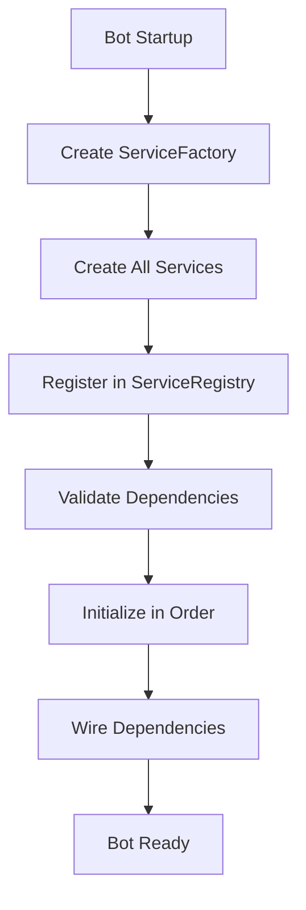

# Service Boundaries and Dependency Injection Architecture

## Overview

This document provides comprehensive documentation of the Discord LLM Bot's service architecture, focusing on service boundaries, dependency injection patterns, and the systematic approach to managing complex service dependencies.

## Table of Contents

1. [Architecture Principles](#architecture-principles)
2. [Service Boundaries](#service-boundaries)
3. [Dependency Injection Framework](#dependency-injection-framework)
4. [Service Lifecycle Management](#service-lifecycle-management)
5. [Interface Contracts](#interface-contracts)
6. [Implementation Patterns](#implementation-patterns)
7. [Examples and Usage](#examples-and-usage)
8. [Best Practices](#best-practices)

## Architecture Principles

### Core Design Philosophy

The bot follows **Domain-Driven Design (DDD)** and **SOLID principles** to maintain clean service boundaries:

1. **Single Responsibility Principle**: Each service has one clear purpose
2. **Open/Closed Principle**: Services are open for extension, closed for modification
3. **Liskov Substitution Principle**: Services can be replaced by their interfaces
4. **Interface Segregation Principle**: Services depend only on methods they use
5. **Dependency Inversion Principle**: Services depend on abstractions, not concretions

### Service Categories

Services are organized into distinct categories with clear boundaries:

```
Core Services (Essential)           Enterprise Services (Optional)
├── GeminiService (AI/LLM)         ├── AnalyticsManager
├── RateLimiter                    ├── HealthMonitor
├── ContextManager                 ├── ConfigurationManager
└── ConversationManager            └── UserPreferenceManager

Support Services (Infrastructure)   Behavior Services (Features)
├── CacheManager                   ├── PersonalityManager
├── RetryHandler                   ├── RoastingEngine
├── GracefulDegradation           ├── BehaviorAnalyzer
└── SystemContextBuilder          └── HelpSystem
```

## Service Boundaries

### Boundary Definition

Each service has clearly defined boundaries that prevent coupling and ensure maintainability:

#### 1. **AI/LLM Services**
- **Primary Service**: `GeminiService`
- **Boundary**: Manages all AI model interactions and response processing
- **Dependencies**: RateLimiter, ContextManager, PersonalityManager, ConversationManager
- **Interface**: `IAIService`

```typescript
// Clear boundary: AI service doesn't know about Discord specifics
interface IAIService {
  processMessage(content: string, context: ConversationContext): Promise<AIResponse>;
  validateConfiguration(): Promise<boolean>;
  getHealthStatus(): ServiceHealthStatus;
}
```

#### 2. **Context Management Services**
- **Primary Services**: `ContextManager`, `ConversationManager`
- **Boundary**: Manages conversation state and user context
- **Dependencies**: CacheManager (optional)
- **Interface**: `IContextManager`, `IConversationManager`

```typescript
// Boundary: Context services manage memory, not AI logic
interface IContextManager {
  buildContext(userId: string, channelId: string): Promise<ConversationContext>;
  updateUserContext(userId: string, data: UserContextData): Promise<void>;
  clearExpiredSessions(): Promise<void>;
}
```

#### 3. **Infrastructure Services**
- **Primary Services**: `RateLimiter`, `CacheManager`, `HealthMonitor`
- **Boundary**: Provide foundational capabilities without business logic
- **Dependencies**: Minimal or none
- **Interfaces**: `IRateLimiter`, `ICacheManager`, `IHealthMonitor`

#### 4. **Behavior Services**
- **Primary Services**: `PersonalityManager`, `RoastingEngine`, `BehaviorAnalyzer`
- **Boundary**: Handle bot personality and behavioral features
- **Dependencies**: ContextManager, CacheManager
- **Interfaces**: `IPersonalityManager`, `IRoastingEngine`, `IBehaviorAnalyzer`

### Cross-Service Communication

Services communicate **only** through well-defined interfaces, never directly:

```typescript
// ✅ Correct: Interface-based communication
class GeminiService implements IAIService {
  constructor(private dependencies: {
    rateLimiter: IRateLimiter;
    contextManager: IContextManager;
    personalityManager: IPersonalityManager;
  }) {}
}

// ❌ Incorrect: Direct class dependencies
class GeminiService {
  constructor(
    private rateLimiter: RateLimiter,  // Concrete class
    private contextManager: ContextManager  // Concrete class
  ) {}
}
```

## Dependency Injection Framework

### ServiceFactory Pattern

The `ServiceFactory` implements the **Factory Pattern** with **Constructor Injection**:

```typescript
export class ServiceFactory implements IServiceFactory {
  createServices(config: BotConfiguration): Map<string, IService> {
    const services = new Map<string, IService>();

    // 1. Create infrastructure services first (no dependencies)
    const configService = this.createConfigurationService();
    const rateLimiter = this.createRateLimiter(config.rateLimiting);
    const healthMonitor = this.createHealthMonitor(config.features.monitoring);

    // 2. Create business services (with infrastructure dependencies)
    const contextManager = this.createContextManager(config.features);
    const personalityManager = this.createPersonalityManager();

    // 3. Create complex services (with multiple dependencies)
    const aiService = this.createAIServiceWithDependencies(apiKey, config.gemini, {
      rateLimiter,
      contextManager,
      personalityManager,
      // ... other dependencies
    });

    return services;
  }
}
```

#### Dependency Resolution Strategy

The factory follows a **topological sort** approach for dependency resolution:

1. **Level 0** (No Dependencies): Configuration, RateLimiter, HealthMonitor
2. **Level 1** (Infrastructure Dependencies): ContextManager, CacheManager
3. **Level 2** (Business Logic Dependencies): PersonalityManager, RoastingEngine
4. **Level 3** (Complex Dependencies): GeminiService (depends on many services)

### ServiceRegistry Pattern

The `ServiceRegistry` implements **Service Locator Pattern** with **Lifecycle Management**:

```typescript
export class ServiceRegistry implements IServiceRegistry {
  private services: Map<string, IService> = new Map();
  private dependencies: Map<string, string[]> = new Map();

  // Register service with dependency declarations
  register<T extends IService>(
    name: string, 
    service: T, 
    dependencies: string[] = []
  ): void {
    this.services.set(name, service);
    this.dependencies.set(name, dependencies);
    this.updateInitializationOrder(); // Topological sort
  }

  // Initialize all services in dependency order
  async initializeAll(): Promise<void> {
    for (const serviceName of this.initializationOrder) {
      const service = this.services.get(serviceName);
      await service.initialize();
    }
  }
}
```

### Initialization Flow

The complete service initialization follows this pattern:



## Service Lifecycle Management

### IService Contract

Every service **must** implement the `IService` interface:

```typescript
interface IService {
  initialize(): Promise<void>;           // Setup resources
  shutdown(): Promise<void>;             // Cleanup resources  
  getHealthStatus(): ServiceHealthStatus; // Current status
}
```

### Lifecycle Phases

#### 1. **Creation Phase**
- Services are created by `ServiceFactory`
- Dependencies are injected via constructor
- No business logic executed yet

#### 2. **Registration Phase**
- Services registered in `ServiceRegistry`
- Dependency graph is built
- Circular dependencies are detected

#### 3. **Initialization Phase**
- Services initialized in dependency order
- Each service sets up required resources
- Failure stops entire initialization

#### 4. **Operational Phase**
- Services handle business logic
- Health monitoring active
- Graceful degradation available

#### 5. **Shutdown Phase**
- Services shut down in reverse order
- Resources cleaned up properly
- State saved if necessary

### Health Monitoring

Each service reports its health status:

```typescript
interface ServiceHealthStatus {
  healthy: boolean;                    // Operational status
  name: string;                       // Service identifier
  errors?: string[];                  // Current errors
  metrics?: Record<string, any>;      // Performance data
  lastCheck?: number;                 // Last health check
}
```

## Interface Contracts

### Contract Design Principles

1. **Minimal Interface Principle**: Interfaces expose only necessary methods
2. **Behavioral Contracts**: Methods have clear pre/post conditions
3. **Error Contracts**: Specific exceptions for specific failure modes
4. **Performance Contracts**: Expected response times documented

### Example: Rate Limiting Contract

```typescript
interface IRateLimiter {
  /**
   * Checks if request is allowed under current rate limits
   * 
   * @param userId - User making the request
   * @returns Promise<boolean> - true if allowed, false if rate limited
   * 
   * @throws RateLimitExceededError - When user exceeds daily limit
   * @throws ServiceUnavailableError - When rate limiter is down
   * 
   * Performance Contract: Must respond within 50ms
   * Side Effects: Updates internal rate tracking
   */
  checkRateLimit(userId: string): Promise<boolean>;

  /**
   * Records a successful request for rate tracking
   * 
   * @param userId - User who made the request
   * @returns Promise<void>
   * 
   * Performance Contract: Must complete within 25ms
   * Side Effects: Increments user's rate count
   */
  recordRequest(userId: string): Promise<void>;
}
```

### Interface Segregation Examples

Instead of one large interface, services use focused interfaces:

```typescript
// ❌ Fat Interface - violates ISP
interface ILargeAIService {
  processMessage(): Promise<string>;
  getRateLimit(): RateLimit;
  getCacheStats(): CacheStats;
  getAnalytics(): Analytics;
  managePersonality(): void;
}

// ✅ Segregated Interfaces - follows ISP
interface IAIService {
  processMessage(content: string, context: Context): Promise<AIResponse>;
  validateInput(content: string): boolean;
}

interface IRateLimitAware {
  getRateLimit(userId: string): Promise<RateLimit>;
}

interface ICacheAware {
  getCacheStats(): CacheStats;
}
```

## Implementation Patterns

### 1. **Constructor Injection Pattern**

All dependencies are injected through the constructor:

```typescript
export class GeminiService implements IAIService {
  constructor(
    private apiKey: string,
    private dependencies: {
      rateLimiter: IRateLimiter;
      contextManager: IContextManager;
      personalityManager: IPersonalityManager;
      cacheManager: ICacheManager;
      gracefulDegradation: IGracefulDegradationService;
      roastingEngine: IRoastingEngine;
      conversationManager: IConversationManager;
      retryHandler: IRetryHandler;
      systemContextBuilder: ISystemContextBuilder;
    }
  ) {
    // All dependencies available immediately
    // No setter injection or service locator calls
  }
}
```

### 2. **Service Locator Pattern** (Registry)

Services can be located by name after registration:

```typescript
// Service registration
registry.register('aiService', aiService, ['rateLimiter', 'contextManager']);
registry.register('rateLimiter', rateLimiter, []);

// Service location
const aiService = registry.getRequired<IAIService>('aiService');
const rateLimiter = registry.get<IRateLimiter>('rateLimiter');
```

### 3. **Factory Method Pattern**

Each service type has a dedicated factory method:

```typescript
class ServiceFactory {
  createRateLimiter(config: RateLimitingConfig): IRateLimiter {
    return new RateLimiter(config.rpm, config.daily);
  }

  createContextManager(config: FeatureConfig): IContextManager {
    return new ContextManager();
  }

  // Complex factory with dependency injection
  createAIServiceWithDependencies(
    apiKey: string,
    config: GeminiConfig,
    dependencies: AIServiceDependencies
  ): IAIService {
    return new GeminiService(apiKey, dependencies);
  }
}
```

### 4. **Graceful Degradation Pattern**

Services handle dependency failures gracefully:

```typescript
class GeminiService implements IAIService {
  async processMessage(content: string, context: Context): Promise<AIResponse> {
    try {
      // Try to get enhanced context
      const enhancedContext = await this.dependencies.contextManager
        .buildEnhancedContext(context);
      return this.processWithEnhancedContext(content, enhancedContext);
    } catch (contextError) {
      // Fallback to basic processing if context service fails
      logger.warn('Context service unavailable, using basic processing');
      return this.processWithBasicContext(content, context);
    }
  }
}
```

## Examples and Usage

### Complete Service Creation Example

Here's how services are created and wired together:

```typescript
// 1. Create configuration
const config: BotConfiguration = {
  rateLimiting: { rpm: 10, daily: 500 },
  gemini: { model: 'gemini-2.5-flash', apiKey: process.env.GEMINI_API_KEY },
  features: {
    monitoring: { enabled: true, healthCheckInterval: 30000 },
    roasting: { baseChance: 0.5, maxChance: 0.9 }
  }
};

// 2. Create service factory
const factory = new ServiceFactory();

// 3. Create all services
const services = factory.createServices(config);

// 4. Create service registry
const registry = new ServiceRegistry();

// 5. Register services with dependencies
registry.register('rateLimiter', services.get('rateLimiter'), []);
registry.register('contextManager', services.get('contextManager'), []);
registry.register('aiService', services.get('aiService'), 
  ['rateLimiter', 'contextManager', 'personalityManager']);

// 6. Initialize all services
await registry.initializeAll();

// 7. Use services
const aiService = registry.getRequired<IAIService>('aiService');
const response = await aiService.processMessage('Hello!', context);
```

### Service Mocking for Testing

The interface-based design enables easy mocking:

```typescript
// Create mock services for testing
class MockRateLimiter implements IRateLimiter {
  async checkRateLimit(userId: string): Promise<boolean> {
    return true; // Always allow for testing
  }
  
  async recordRequest(userId: string): Promise<void> {
    // No-op for testing
  }
  
  async initialize(): Promise<void> {}
  async shutdown(): Promise<void> {}
  getHealthStatus(): ServiceHealthStatus {
    return { healthy: true, name: 'MockRateLimiter' };
  }
}

// Use in tests
const mockRateLimiter = new MockRateLimiter();
const mockContextManager = new MockContextManager();

const aiService = new GeminiService(apiKey, {
  rateLimiter: mockRateLimiter,
  contextManager: mockContextManager,
  // ... other mocks
});
```

### Service Configuration Update

Services support dynamic configuration updates:

```typescript
// Update rate limiting configuration
const newRateLimitConfig = { rpm: 15, daily: 750 };
const rateLimiter = registry.getRequired<IRateLimiter>('rateLimiter');

if ('updateConfiguration' in rateLimiter) {
  const updated = await rateLimiter.updateConfiguration(newRateLimitConfig);
  if (updated) {
    logger.info('Rate limit configuration updated successfully');
  }
}
```

## Best Practices

### 1. **Dependency Management**

```typescript
// ✅ Good: Minimal dependencies, clear interfaces
class ServiceA implements IServiceA {
  constructor(
    private serviceB: IServiceB,
    private serviceC: IServiceC
  ) {}
}

// ❌ Bad: Too many dependencies, suggests poor design
class ServiceA implements IServiceA {
  constructor(
    private serviceB: IServiceB,
    private serviceC: IServiceC,
    private serviceD: IServiceD,
    private serviceE: IServiceE,
    private serviceF: IServiceF,
    private serviceG: IServiceG  // Consider refactoring
  ) {}
}
```

### 2. **Error Handling**

```typescript
// ✅ Good: Specific error types, graceful degradation
class GeminiService implements IAIService {
  async processMessage(content: string): Promise<AIResponse> {
    try {
      return await this.callGeminiAPI(content);
    } catch (error) {
      if (error instanceof RateLimitExceededError) {
        throw new ServiceUnavailableError('Rate limit exceeded', error);
      } else if (error instanceof NetworkError) {
        // Try fallback
        return this.generateFallbackResponse(content);
      }
      throw error;
    }
  }
}
```

### 3. **Service Boundaries**

```typescript
// ✅ Good: Clear responsibility separation
interface IAnalyticsService {
  trackEvent(event: AnalyticsEvent): Promise<void>;
  generateReport(criteria: ReportCriteria): Promise<Report>;
}

interface IAIService {
  processMessage(content: string, context: Context): Promise<AIResponse>;
}

// ❌ Bad: Mixed responsibilities
interface ILargeService {
  processMessage(): Promise<string>;
  trackAnalytics(): Promise<void>;     // Should be separate service
  manageCache(): Promise<void>;        // Should be separate service
  handleRateLimit(): Promise<boolean>; // Should be separate service
}
```

### 4. **Configuration Management**

```typescript
// ✅ Good: Type-safe configuration with validation
interface ServiceConfig {
  timeout: number;
  retries: number;
  enableFeatureX: boolean;
}

class MyService implements IService {
  constructor(private config: ServiceConfig) {
    this.validateConfig(config);
  }
  
  private validateConfig(config: ServiceConfig): void {
    if (config.timeout <= 0) {
      throw new Error('Timeout must be positive');
    }
    if (config.retries < 0) {
      throw new Error('Retries cannot be negative');
    }
  }
}
```

### 5. **Lifecycle Management**

```typescript
// ✅ Good: Proper resource cleanup
class DatabaseService implements IService {
  private connection?: DatabaseConnection;
  
  async initialize(): Promise<void> {
    this.connection = await createConnection(this.config);
  }
  
  async shutdown(): Promise<void> {
    if (this.connection) {
      await this.connection.close();
      this.connection = undefined;
    }
  }
  
  getHealthStatus(): ServiceHealthStatus {
    return {
      healthy: this.connection?.isConnected() ?? false,
      name: 'DatabaseService',
      errors: this.connection?.getErrors() ?? ['Not initialized']
    };
  }
}
```

---

## Summary

The Discord LLM Bot's service architecture provides:

1. **Clear Service Boundaries** - Each service has a single, well-defined responsibility
2. **Dependency Injection** - Services receive dependencies through constructor injection
3. **Interface Contracts** - All communication happens through well-defined interfaces
4. **Lifecycle Management** - Systematic initialization, operation, and shutdown
5. **Health Monitoring** - Real-time service health tracking and reporting
6. **Graceful Degradation** - Services continue operating when dependencies fail
7. **Testability** - Interface-based design enables easy mocking and testing

This architecture ensures maintainability, testability, and extensibility while managing the complexity of a multi-service Discord bot application.